# Project MINTO!

- [백엔드 링크](https://github.com/mint0o0/minto-backend)
- [NFT 링크](https://github.com/mint0o0/minto-nft)

## 🎪 민토와 함께 축제를 특별하고 소중한 추억으로 만들어요

> 축제 정보를 확인하고 축제 기념품을 NFT로 발급받을 수 있습니다!

### 관리자 관점
- 관리자(본인)이 관리하는 축제를 한눈에 확인할 수 있습니다.
- 축제를 수정 및 생성을 손쉽게 할 수 있습니다.
- 축제에 참여할 사용자가 수행할 미션을 쉽게 생성할 수 있습니다.
- 미션을 완료한 사용자가 받을 NFT를 생성형 AI 또는 이미 디자인된 이미지로 쉽게 생성할 수 있습니다.
### 사용자 관점
- 축제 팜플렛을 앱으로 바뀌어 한 손에 들고 다니기 쉬워졌습니다.
- 사용자는 회원가입과 동시에 전자지갑을 생성할 수 있습니다.
- 사용자들은 여러 축제를 카테고리 별로 한눈에 쉽게 확인할 수 있습니다.
- 축제에 참여하면서 축제의 편의시설(화장실, 부스, 안내처 등) 위치정보를 쉽게 확인할 수 있습니다.
- 미션을 완수하고 모든 스탬프를 수집하면 사용자에게 축제별로 생성된 특별한 기념품(NFT)을 받을 수 있습니다.
- 자신이 방문했던 축제에 대한 기록을 마이페이지에서 쉽게 확인할 수 있습니다.

# 📃 앱 메뉴얼

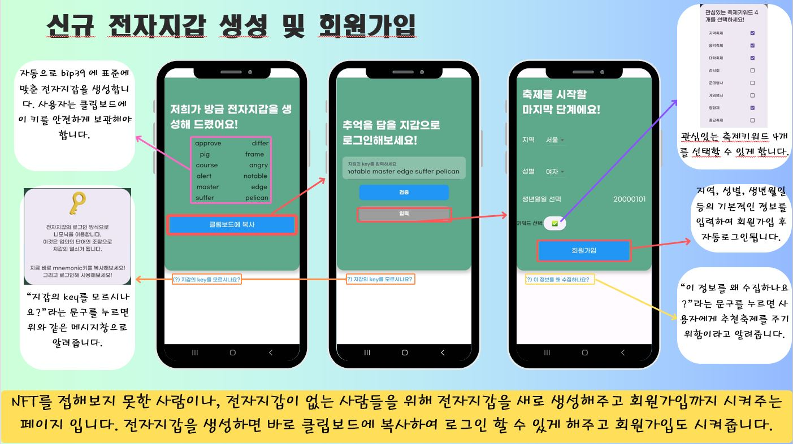
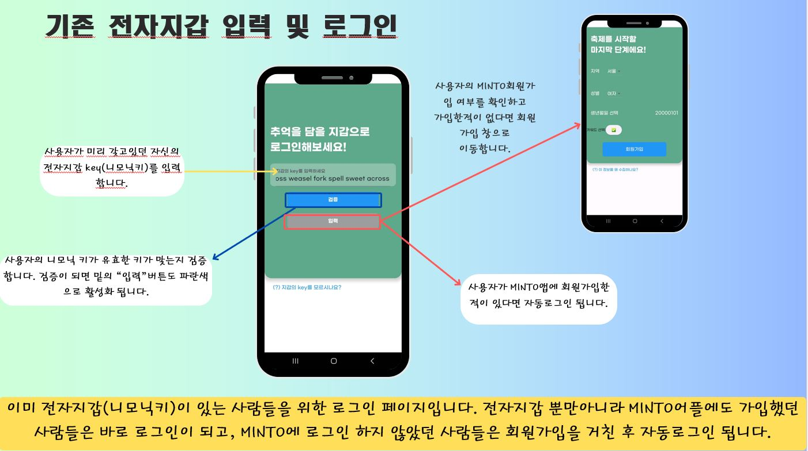
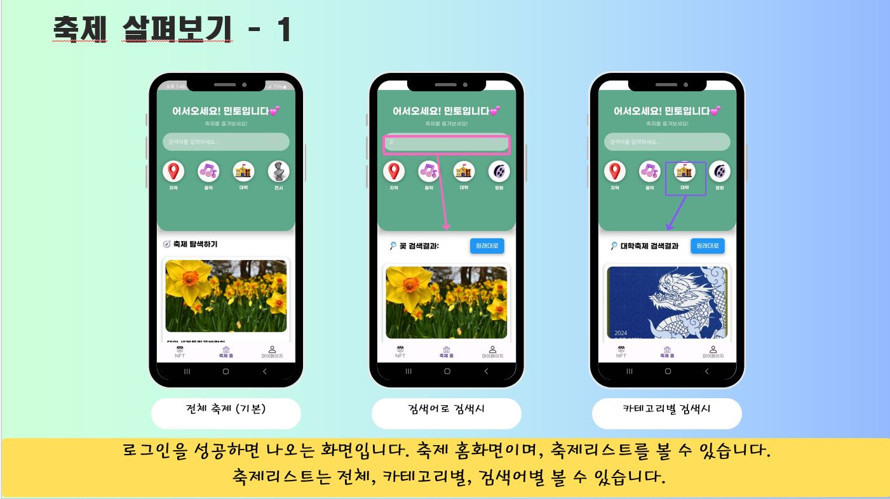
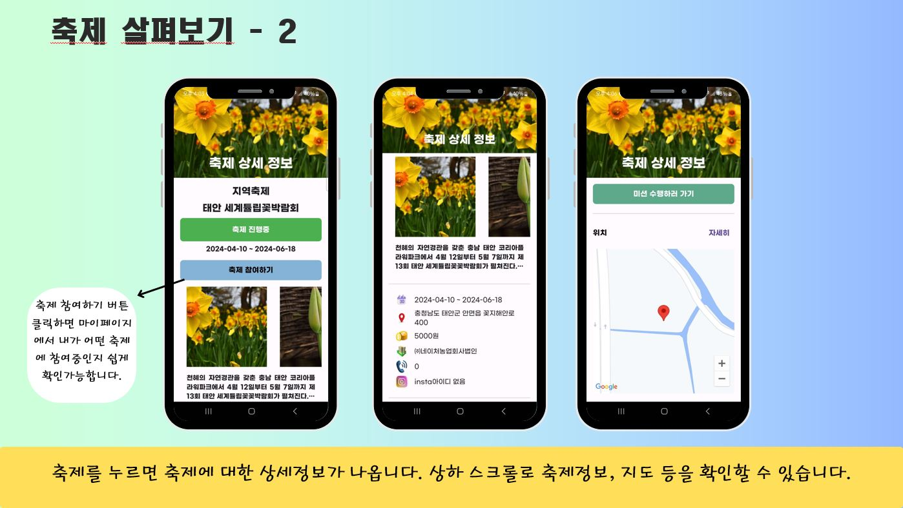
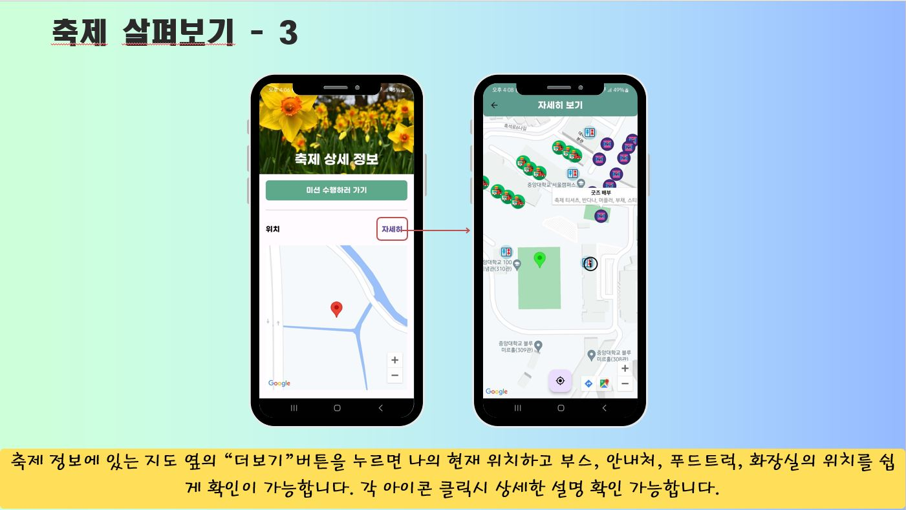
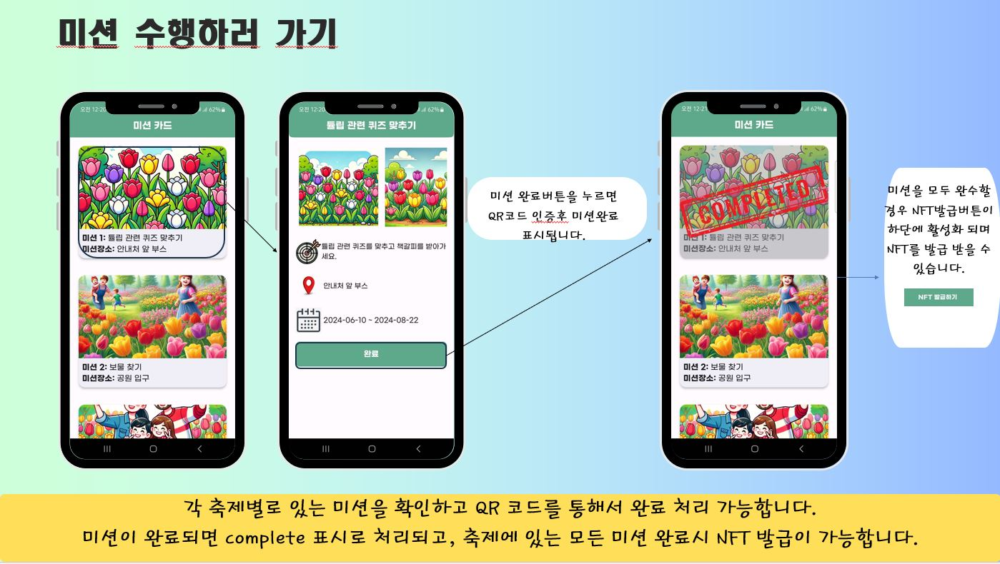
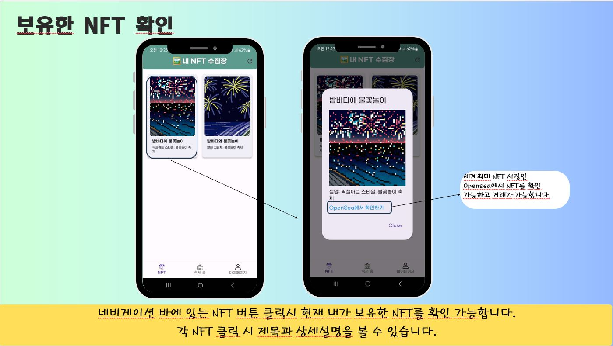
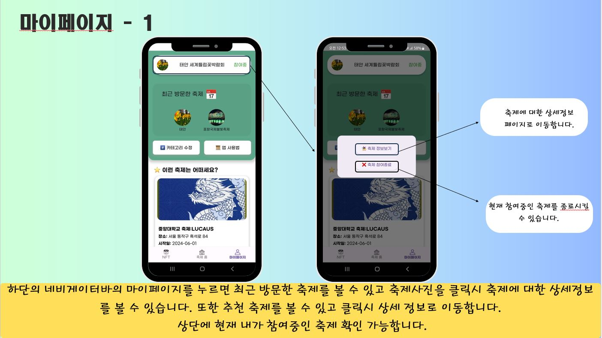
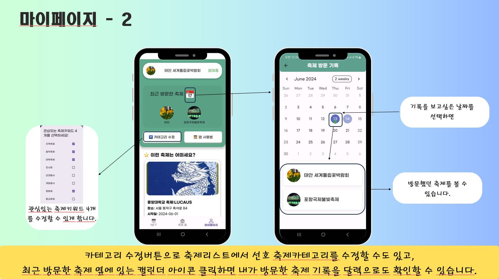
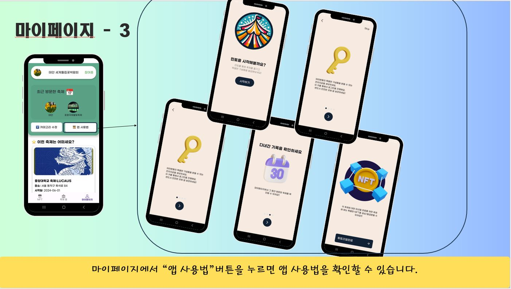
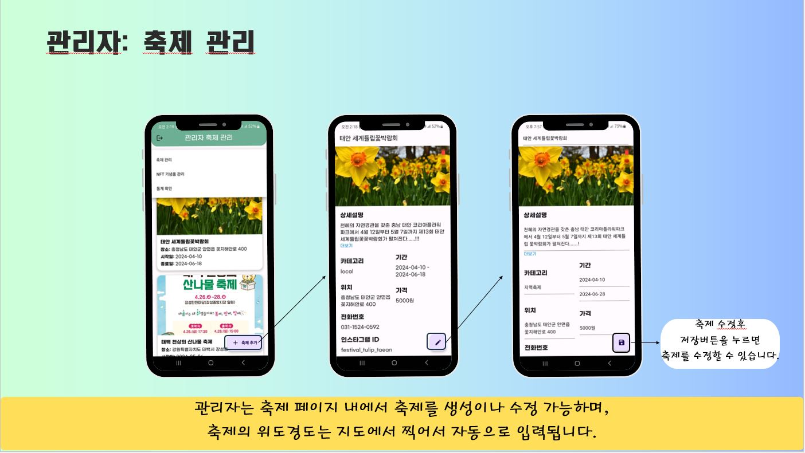
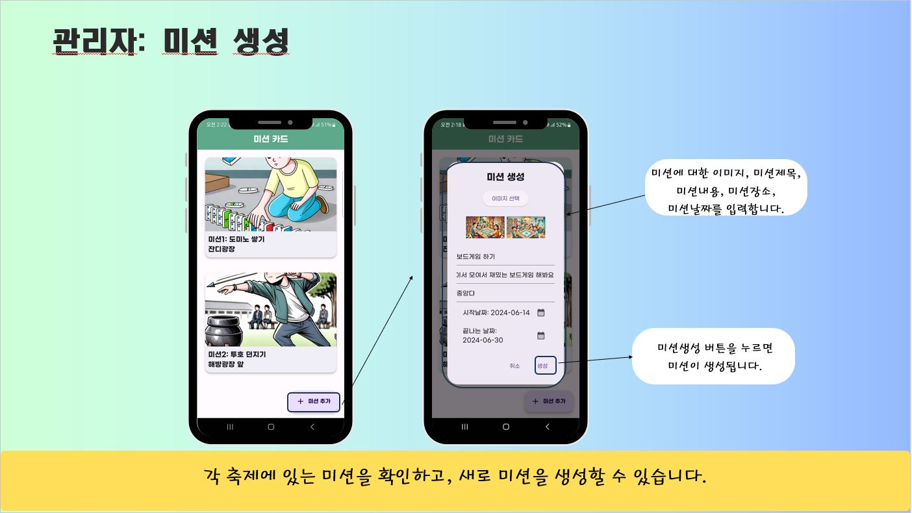
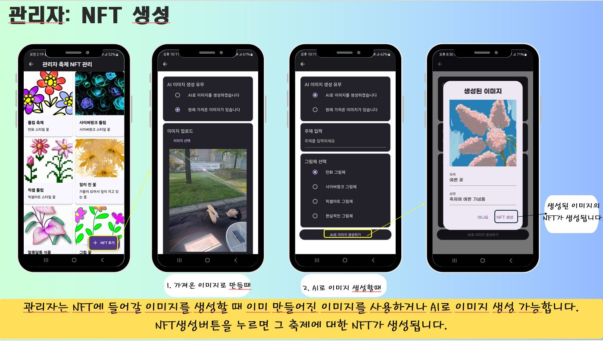
# 👨‍👦‍👦 팀원 소개

|              [박유나](https://github.com/realyuna)           |            [이지학](https://github.com/easyhak)             |         
|:------------------------------------------------------------:|:------------------------------------------------------------:|
|  |  | 
|                       Frontend, Design                       |                      Backend,NFT(Smart Contract)                     |                         

# 🛠️  기술 스택

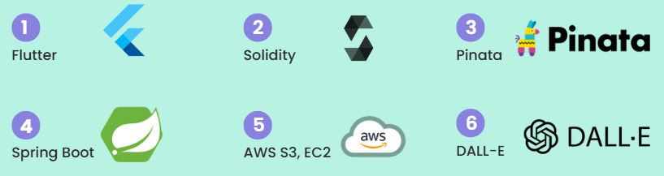

# 📱 앱 실행 방법
>안드로이드에서만 가능합니다.
Git clone 후에 build 해보세요
